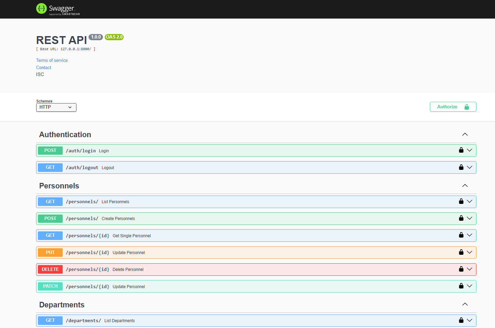

# PERSONNEL API

API applications were made in this project. In addition to my previous projects, I have made a few additions to this project. For example, I added validation to the queries made by the user using Token. I recorded log queries of every request made. Additionally, as a result of the queries, I checked whether the user was authorized to do what he wanted to do (Authority Check).
    (MODEL) There are 3 modules in the project. These are Token model, department model and personnel model. Records of the tokens of users who log in to the token model are stored. Department information is stored in the Department model and personnel records are stored in the Personnel model.
    (MIDDLEWARE) There are 5 middleware in the project. These are authentication, errorhandler, logging, permissions and queryhandler.
    You can examine the contents of these files by following the src/middleware path.
You can review all the details of the project in the src folder. I tried to write fairly clean code. Have a nice day!

### Swagger


### ERD:


### Folder/File Structure:

```
    .env
    .gitignore
    .access.log
    index.js
    README.md
    package.json
    logs/
    images/
    src/
        configs/
            dbConnection.js
        controllers/
            department.controller.js
            personnel.controller.js
            auth.controller.js
            token.controller.js
        helpers/
            passwordEncrypt.js
            sync.js
        middlewares/
            errorHandler.js
            authentication.js
            queryHandler.js
            logging.js
            permissions.js
        models/
            department.model.js
            personnel.model.js
            token.model.js
        routes/
            department.router.js
            personnel.router.js
            auth.router.js
            token.router.js
            index.js
```


